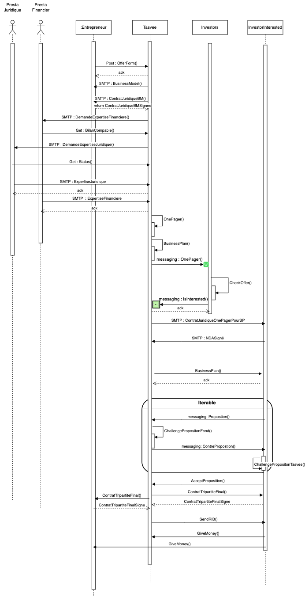
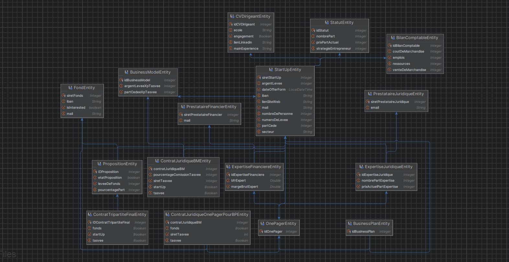

## Objectifs du système à modéliser

On propose de modéliser un **système d'intermédiaire financier** (Tasvee) pour effectuer des **levées de fonds d'entrepreneurs** (StartUp) à travers plusieurs fonds d'investissement (Fonds). Le système d'intermédiaire financier gère **la documentation et la négociation** tout au long du processus et en fonction des différents parties prenantes.

- Sur le plan **administratif**, il coordonne et synthétise les activités d'audit des conseillers juridiques (PrestataireJuridique), financiers (PrestataireFinancier) au sujet de l'entrepreneur (StartUp). Il coordonne également la sélection du Financeur(Fonds). Chaque acteur produit de la documention en fonction de la documentation d’autres(voir le schéma relationnel).
- Sur un **plan business**, (Tasvee) se met d'accord avec l'entrepreneur (StartUp) sur les attentes puis négocie avec les fonds d'investissement (Fonds) pour lever un maximum de fonds et obtenir les meilleures clauses possibles pour l'entrepreneur (StartUp).

Lors de la levée de fonds d'un entrepreneur(StartUp), il y a **4 phases principales** avec des acteurs différents à chaque.

- **Deal** ((StartUp) - (Tasvee)) : vérification d'un intérêt mutuel et cadrage du contrat souhaité [ContratJuridiqueBM].
- **Production** ((Tasvee) - (PrestataireFinancier)  et (Tasvee) - (PrestataireJuridique)) : production de la documentation sur l'entreprise pour obtenir les fonds. Les documents [ExpertiseJuridique] et [ExpertiseFinancière] sont produits par le (PrestataireFinancier) et le (PrestataireJuridique).
- **Négociation** ((Tasvee) - (Fonds)) : L'intermédiaire financier interagit avec les Fonds pour négocier et trouver l'offre la plus intéressante en fonction du contrat souhaité par l'entrepreneur(StartUp). C’est réalisé à travers un [OnePager] qui sert de flyer puis un [BusinessPlan] qui sert de détails du [OnePager].
- **Commercialisation** ((StartUp) - (Tasvee) - (Fonds)) : Signature finale de la [PropositionFinale] entre les 3 acteurs, coordonnée par l'intermédiaire financier (TASVEE).

La startup envoie ses informations, y compris l'objectif de fonds à lever et le nombre de parts que l'entrepreneur est prêt à céder, via un formulaire à Tasvee. Tasvee effectue une première analyse de ces informations et propose des termes pour accompagner l'entreprise via un contrat juridique.
Suite à cette signature, Tasvee engage des prestataires financiers et juridiques pour conduire des recherches approfondies sur les aspects juridiques et financiers en fonction des informations de la startup.
Ensuite, Tasvee présente un premier document synthétique pour voir si des investisseurs sont intéressés. Si c'est le cas, les investisseurs signent un contrat qui les oblige à passer par Tasvee pour investir dans cette startup. Tasvee envoie alors un document avec toutes les informations. Les fonds, en fonction de leur stratégie, et Tasvee, en fonction de son objectif, négocient via plusieurs propositions et contre-propositions jusqu'à ce qu'ils parviennent à un accord.
Une fois l'accord conclu, ils signent un contrat juridique. Suite à cela, l'argent est versé à l'entrepreneur et à Tasvee en fonction de sa commission relative.
## Interfaces

## Schéma relationnel

## Exigences fonctionnelles

* L'intermédiaire (Tasvee) DOIT recevoir la demande de l'entrepreneur (StartUp). 
* L'intermédiaire (Tasvee) DOIT se mettre d'accord avec l'entrepreneur (StartUp) sur ses attentes. 
* Chaque investisseur (Fonds) DOIT avoir une stratégie de sélection et formuler des offres en fonction de son intérêt. 
* L’intermédiaire (Tasvee) DOIT demander la production de documentation sur l'entrepreneur (StartUp) par les conseillers financiers et juridiques pour obtenir les fonds. 
* L’intermédiaire (Tasvee) DOIT récupérer la production de documentation sur l'entrepreneur (StarUp) par les conseillers financiers et juridiques (Prestataires). 
* L'intermédiaire (Tasvee) DOIT diffuser les documents généraux pour les investisseurs(Fonds). 
* L'investisseur (Fonds) intéressé DOIT contacter l'intermédiaire (Tasvee). 
* L'intermédiaire (Tasvee) DOIT diffuser les documents spécifiques pour les investisseurs(Fonds). 
* L’intermédiaire (Tasvee) DOIT négocier avec les investisseurs (Fonds) pour lever un maximum de fonds et obtenir les meilleures clauses possibles pour l'entrepreneur (StartUp). 
* L’intermédiaire (Tasvee) DOIT enregistrer les informations finales (montant, transaction, parts, interet, etc.). 
* Le Fonds (Fonds) DOIT verser l'argent à l'intermédiaire (TASVEE) et à l'entrepreneur (StartUp).

## Exigences non fonctionnelles

* Les communications et échanges de données DOIVENT être fiables et utiliser le messaging.
* Aucune donnée ne DOIT passer par un destinataire non souhaité ou externe.
* La négociation menée par l’intermédiaire (Tasvee) avec les fonds d'investissement DOIT être rapide et efficace pour obtenir l'offre la plus intéressante pour l'entreprise.
 
## Comment utiliser l'application
* Suivre les instructions qui vous sont affiché dans la console (en gardant l'oeil sur le diragrame dde séquence) :
- Éxecuter Entreprise
- Éxecuter Tasvee
- Éxecuter Fonds

PART 1
- Dans la console de Entreprise :
   - le Main se lance et vous demande de remplir un OfferForm (le BilanComptable, le Statut juridique, le CV dirigeant, etc).
   - Après remplissage, cliquer "y" pour que l'OfferForm soit envoyer sur le endpoint (Post) de Tasvee.
   - La resource offer-form/new-offer (@Post) du SI Tasvee prend en paramètre un OfferForm (DTO).
- Dans la console Tasvee :
   - L'offerForm est reçu :
     - Tasvee vérifie si L'offerForm est valide (objectLevee>=100000)
     - Le Business Model de l'entreprise (startup) est construit à partir de l'offerForm. Puis le BM est stocké en DB.
     - Le Business Model est envoyer par smtp à l'entreprise concernée.
     - Le Contrat juridique du Business Model de l'entreprise (startup) est construit à partir des informations stocké (OfferForm + BM). Puis le Contrat Juridiquedu BM est stocké en DB.
     - Le Contrat juridique du Business Model est envoyer par smtp à l'entreprise concernée.
- Dans la console Entreprise :
  - Le Business Model est reçu (smtp) :
     - Le Busines Model doit être téléchargé depuis le mail reçu, puis déposer dans le dossier Entreprise/data/BM
     - Le Business Model est enregistré en DB
  - Le Contrat Juridique du Business Model est reçu (smtp) :
     - Le Contrat Juridique du Busines Model doit être téléchargeé depuis le mail reçu, puis déposer dans le dossier Entreprise/data/CJ
     - Le Contrat Juridique du Business Model est enregistré en DB
     - La console (Entreprise) demande la signature signature du contrat jurisique du business model reçu, en en tapant "y" dans la console.
     - Le Contrat Juridique du Business Model [signé] est update en DB avec la signature (startup = true).
     - Le Contrat Juridique du Business Model [signé] est renvoyé à Tasvee par smtp.
- Dans la console Tasvee :
  - Le Contrat Juridique du Business Model [signé] par l'entreprise est reçu par smtp :
     - Le Contrat Juridique du Business Model [signé] par l'entreprise doit être téléchargé depuis le mail reçu, puis déposer dans le dossier Tasvee/data/CJSigné
     - Le Contrat Juridique du Business Model [signé] par l'entreprise est update en DB.
  - Tasvee envoi par smtp une demande d'expertise au prestataire Financier, en lui fournissant (par mail) l'ID du Bilan comptable et l'url endpoint (@GET) pour que la prestataire puisse le récupérer.
  - Tasvee envoi par smtp une demande d'expertise au prestataire Juridique, en lui fournissant (par mail) l'ID du Statut et l'url endpoint (@GET) pour que la prestataire puisse le récupérer.
- Le prestataire Financier recoit par mail la demande d'expertise :
  - C'est une acteur humain, il envoi par retour de mail à Tasvee son expertise Financière.
  - Tasvee receptionne le mail avec l'expertise Financière (Json en pièce jointe)
  - L'Expertise Financiere doit être téléchargeé depuis le mail reçu, puis déposer dans le dossier Tasvee/data/EF
    - Console Tasvee : L'expertise Financière est enregistrée en Db.
- Le prestataire Juridique recoit par mail la demande d'expertise :
  - C'est une acteur humain, il envoi par retour de mail à Tasvee son expertise Juridique.
  - Tasvee receptionne le mail avec l'expertise Juridique (Json en pièce jointe)
  - L'Expertise Juridique doit être téléchargeé depuis le mail reçu, puis déposer dans le dossier Tasvee/data/EF
    - Console Tasvee : L'expertise juridique est enregistrée en Db.
   
PART 2
- Appeler la resource /OnePager/create qui vous demandera des options afin de créer le OnePager
- Il faudra ensuite appeler /OnePager/sendOnePager qui enverra le OnePager correspondant au siret que vous aurez entré
- Il suffira ensuite d'appeler la resource business-plan/bp/{siretEntr}/{siretFond} pour créer le business plan de l'entreprise.
- Une queue comprenant un topic va proposer aux Fonds ce topic pour envestir et ils répondront si ils sont interessés (les secteurs possibles étant "T", "S", "I", "F" et "E").  
- Lorsque le fond est interessé il va récupérer l'OfferForm, l'étudier et Tasvee va agréger les OfferForm pour les envoyer à Tasvee.
- Tasvee va alors envoyer un SMTP (mail) contenant le ContratJuridiqueOnePagerPourBP afin que le Fond prenne connaissance ce contrat et le renvoyer signé par SMTP.
- Lorsque Le fond reçoit le BusinessPlan, il va l'étudier et créer une proposition qui constituera son intêret/ses revenus/ses parts de l'entreprise et l'envoyer à Tasvee.
- Tasvee va récupérer la Proposition, la prendre en compte et négocier avec le Fond, jusuqu'à ce que Tasvee et Fond trouvent un accord.
- Lorsque l'un des deux acteurs accepent la proposition, il le signale à l'autre acteur.
- Tasvee va alors établir un NDATripartiteFinal  qu'il enverra à Fond pour qu'il le signe puis à l'Entrepreneur pour qu'il le signe également.
- Tasvee signe également le NDATripartiteFinal qui constitue l'accord entre les 3 acteurs.
- Il va ensuite envoyer le RIB au Fond afin qu'il envoie l'argent convenu à Tasvee et à l'Entrepreneur.
